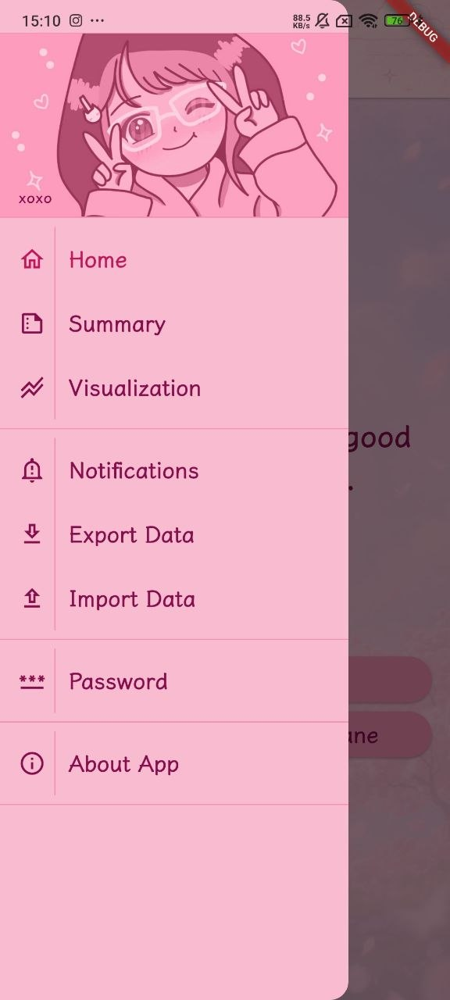
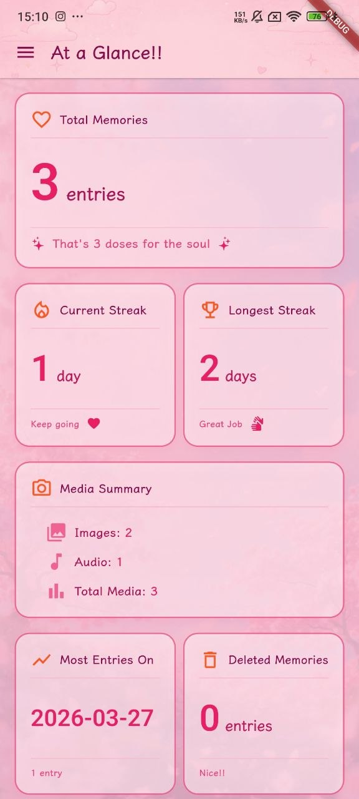
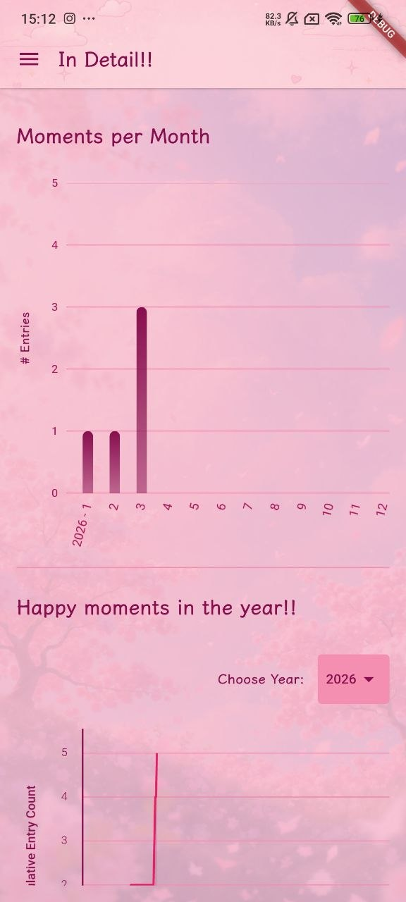
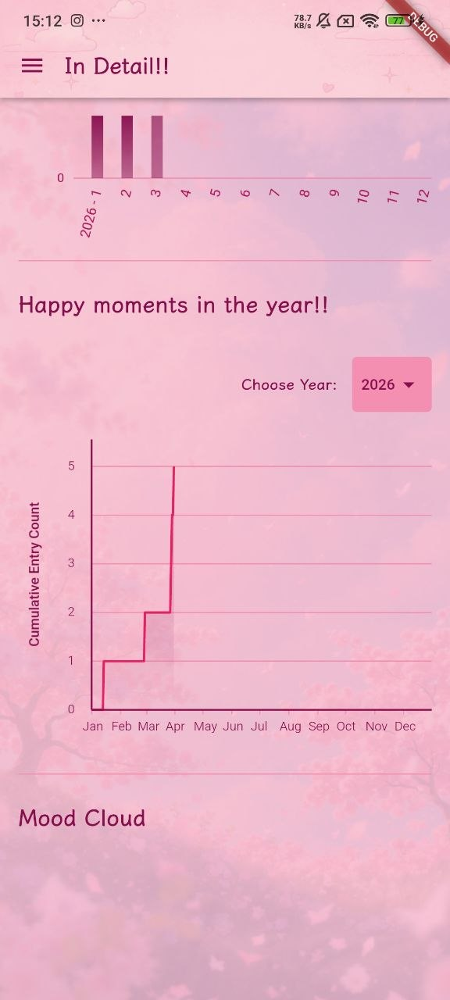
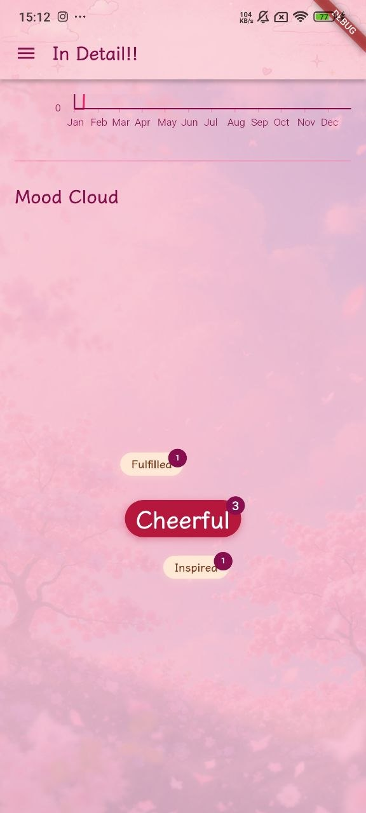
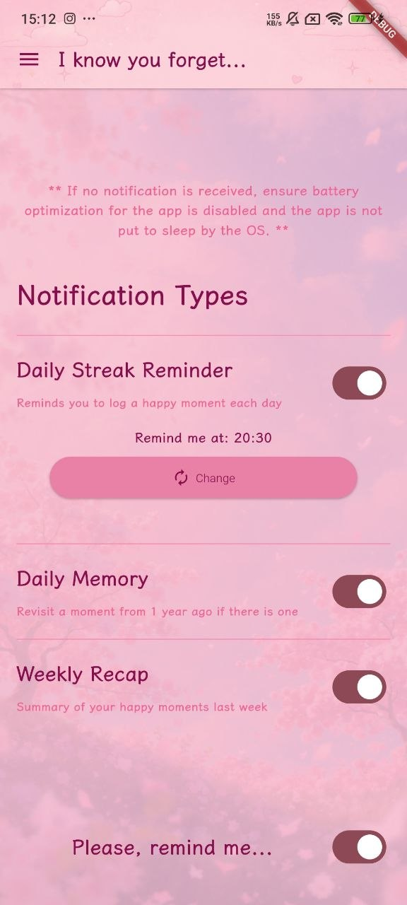
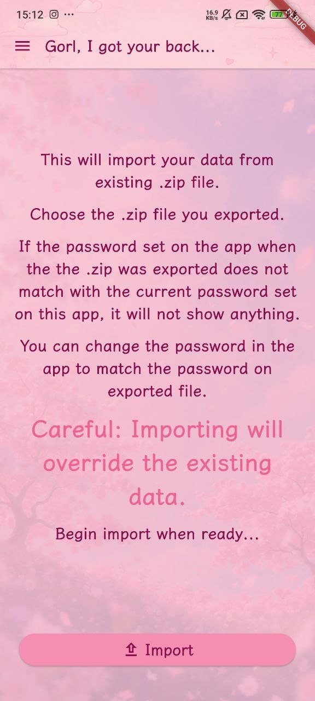
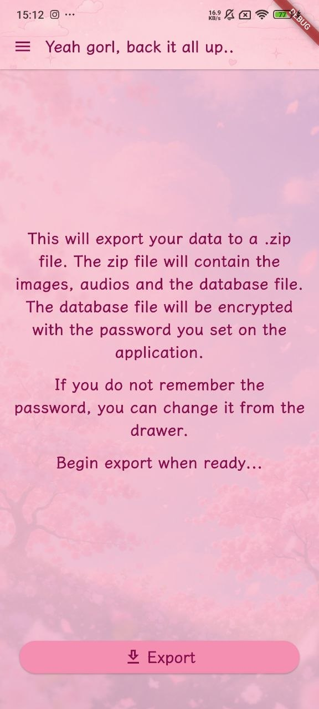
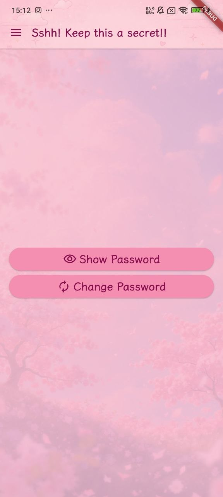

# ADiary
Record your best memories and relive them when you're down. Cause we tend to forgot the good times and get stuck on the bad ones.

# Release Notes
## Version 3.0.0

### Features Added
- Record Audio because good feeling is best recorded in your voice
- Authenticate with password if local authentication is not enabled
- Can Add a feeling (Mood) to each entry
- Ability to delete an entry (if needed)
- Data highlights
- Visualizations with Charts and Mood Cloud
- Different kinds of notification with individual toggles
  - Daily Reminders to record an entry
  - Memories (This day x years ago)
  - Weekly Recap
- Image Gallery now has infinite loop

### Other Changes
- UI/UX enhancements
  - Updated font
  - Splash Screen
  - Backgorund images
  - Icons updates
  - Logo update
- App operational improvements

## Version 2.0.0

### Features Added
- Ability to add Images to record visuals
- Daily notifications reminder

### Other changes
- UI/UX enhancements
- Potential iOS support (needs testing)

## Version 1.0.0

### Features
- Record your good memories
- Export/Import your data
- Encrypted data
- Authentication with biometrics

# Features coming soon:
* Rating for memories
* And so much more

# Getting Started
Install the latest APK package from Releases Section of this repository. And Enjoy

# To build it yourself
1. Get the Flutter Developement Environment setup. There's lots of resource available online for this.
2. Clone the repo
3. Create required files for launch icon
    ```
    flutter pub run flutter_launcher_icons 
    ```
4. Create required files for splash screen
    ```
    dart run flutter_native_splash:create --path=flutter_native_splash.yaml
    ```
5. Now build your app. 
6. Enjoy

# Screenshots
  
  
  
  
 

# Contributing
I am accepting pull requests if you want to contribute.

Cheers!!!
