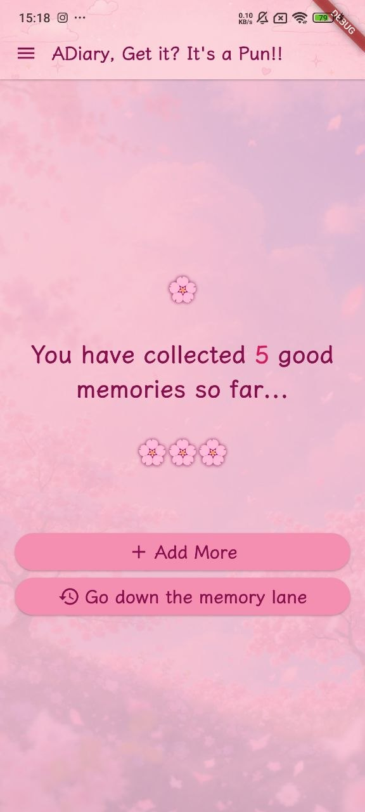
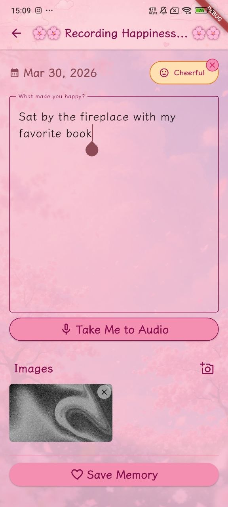
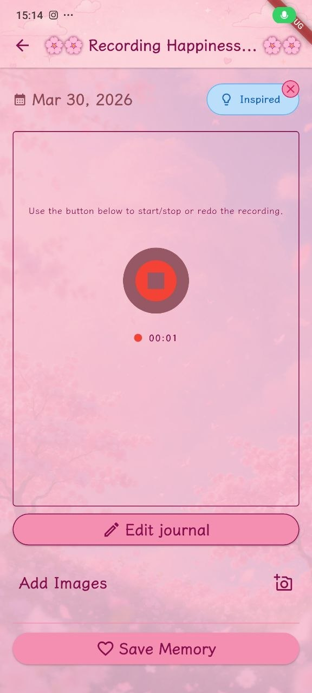
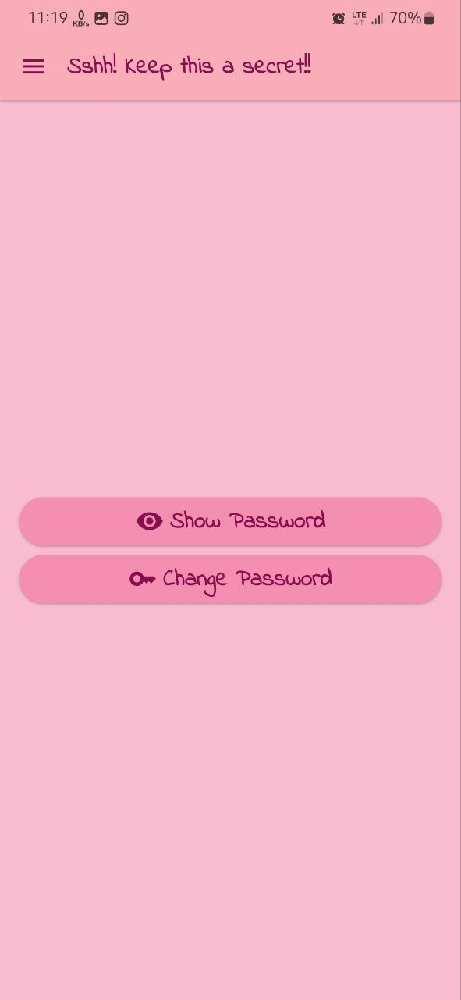

# ADiary
Record your best memories and relive them when you're down. Cause we tend to forgot the good times and get stuck on the bad ones.

# Release Notes
## Version 2.0.0

### Features Added
- Ability to add Images to record visuals
- Daily notifications reminder

### Other changes
- UI/UX enhancements
- Potential iOS support (needs testing)

## Version 1.0.0

### Features
- Record your good memories
- Export/Import your data
- Encrypted data
- Authentication with biometrics

# Features coming soon:
* Rating for memories
* And so much more

# Getting Started
Install the latest APK package from Releases Section of this repository. And Enjoy

# To build it yourself
1. Get the Flutter Developement Environment setup. There's lots of resource available online for this.
2. Clone the repo
3. Now build your app. 
4. Enjoy

# Screenshots
  
 

# Contributing
I am accepting pull requests if you want to contribute.

Cheers!!!
